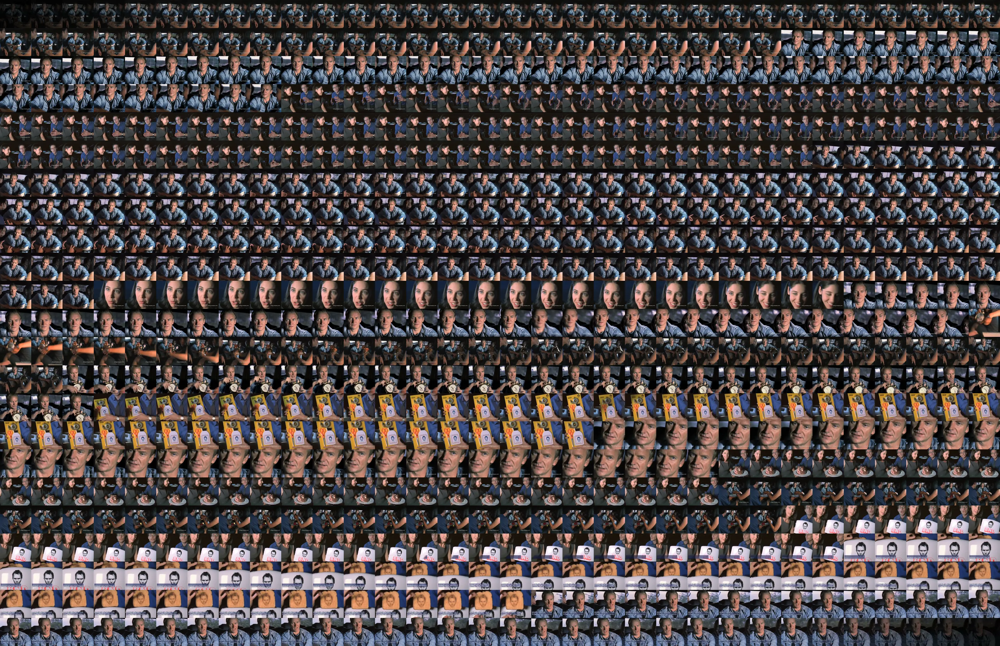

# Movie Finger Prints

_Movie Finger Prints_ is a desktop application that transforms a video file into a single visual artifact — a poster composed of frames extracted across the entire runtime.


## Example Output



## What It Does

_Movie Finger Prints_ analyzes the timeline, extracts evenly spaced frame captures, and composes them into a single image using flexible layout strategies. The result is a poster-like artifact that encodes the video’s visual progression from start to finish.

Features include:

* Configurable frame density
* Multiple layout modes
* Key-frame highlighting options
* High-resolution export

The output is both analytical and aesthetic — part summary, part artwork.

## Prerequisites

- **Python 3.7+**
- **ffmpeg** and **ffprobe** must be installed and available on your `PATH`

  ```bash
  # macOS (Homebrew)
  brew install ffmpeg

  # Ubuntu / Debian
  sudo apt install ffmpeg

  # Windows (Chocolatey)
  choco install ffmpeg
  ```

## Installation

```bash
git clone https://github.com/johnfmorton/movie-finger-prints.git
cd movie-finger-prints
pip install -r requirements.txt
```

## Usage

```bash
python main.py
```

Or, if you use python3:

```bash
python3 main.py
```

### Workflow

1. **Select a video** — supports `.mp4`, `.mkv`, `.avi`, `.mov`, `.wmv`, `.flv`, and `.webm`
2. **Configure the grid** — choose between two grid modes:
   - **Standard** — set columns and rows (default 30x20 = 600 frames) with a choice of fill orders (Standard, Spiral from center, Diagonal) shown in a live preview
   - **Quadtree** — recursive subdivision creates variable-sized cells for a striking mosaic effect. Configure depth (1–6), subdivision style, and seed:
     - *Balanced* — always subdivides to max depth (4^depth cells)
     - *Random* — 70% chance to subdivide at each level (seeded RNG)
     - *Center weighted* — higher subdivision probability near the canvas center
3. **Choose cell aspect ratio** — auto-detect from the video, pick a preset (16:9, 4:3, 1:1), or enter a custom ratio
4. **Pick an output size** — presets for common displays or custom dimensions up to 20,000x20,000 px:
   | Preset | Resolution |
   |---|---|
   | MacBook Pro 16" | 3456x2234 |
   | MacBook Pro 14" | 3024x1964 |
   | MacBook Air 15" | 2880x1864 |
   | MacBook Air 13" | 2560x1664 |
   | iMac 24" | 4480x2520 |
   | Apple Studio Display | 5120x2880 |
   | Pro Display XDR | 6016x3384 |
   | 4K UHD | 3840x2160 |
   | 1080p | 1920x1080 |
5. **Choose output format** — PNG (default), JPEG, WebP, or TIFF, with quality slider for lossy formats
6. **Style the output** — configure padding between cells, background color (black, white, dark gray, or custom), and optional cell labels (frame number or timestamp)
7. **Toggle "Skip black frames"** (on by default) to filter out fades and letterboxing
8. **Generate** — a progress bar tracks extraction and compositing

## Project Structure

```
movie-finger-prints/
├── main.py              # Application entry point
├── requirements.txt     # Python dependencies
├── core/
│   ├── video.py         # Video probing (ffprobe) and frame extraction (ffmpeg)
│   ├── filters.py       # Black frame detection via mean pixel intensity
│   ├── compositor.py    # Grid composition (uniform and quadtree layouts)
│   ├── fill_order.py    # Fill order strategies (standard, spiral, diagonal)
│   └── quadtree.py      # Quadtree subdivision algorithm
└── gui/
    ├── main_window.py   # PyQt6 desktop interface
    └── grid_preview.py  # Live grid preview widget with fill-order visualization
```

## How It Works

1. **Probe** — `ffprobe` reads video metadata (duration, resolution, frame count)
2. **Extract** — `ffmpeg` pulls JPEG frames at evenly-spaced timestamps, sampling at the midpoint of each interval for better representation
3. **Filter** — optionally discards near-black frames (mean pixel intensity below a threshold); if too many frames are removed, it falls back to the full set and evenly re-samples to preserve timeline coverage
4. **Compose** — frames are center-cropped to the target cell aspect ratio, resized with Lanczos filtering, and placed into a grid (uniform or quadtree layout); the final image is saved in the chosen format

## Dependencies

| Package | Purpose |
|---|---|
| [PyQt6](https://pypi.org/project/PyQt6/) | Desktop GUI |
| [Pillow](https://pypi.org/project/Pillow/) | Image processing |
| [NumPy](https://pypi.org/project/numpy/) | Frame analysis (black frame detection) |

## License

See [LICENSE](LICENSE) for details.
